# Shopaholic EasyBuyer Product Documentation

This document describes the demo's target user, inputs and outputs, architecture, and evaluation status. It separates intended metrics from results that have evidence in the project files.

## Persona

**Target persona:** a frequent online shopper, approximately 20–40 years old, who wants to save time comparing products and may not know a category well. The user shops in e-commerce and consumer retail and wants practical guidance before deciding what to buy.

**Need:** describe a product in ordinary language, optionally include a budget, then receive a short list of relevant products with prices and individual purchase links.

## Input

### Shopper input

- A natural-language product request, such as `knife under 300 SGD`.
- Optional preferences and exclusions expressed in the query.
- Optional maximum price and currency.

### Runtime configuration and data

- `OPENROUTER_API_KEY` enables foundation-model intent parsing; local parsing is used if the key is missing or the request fails.
- `BUYWHERE_API_KEY` enables live catalog search; the app uses the CSV snapshot when live retrieval yields no usable results.
- `OPENROUTER_MODEL` selects the model; its current default is `openai/gpt-5-mini`.
- `data/products_snapshot.csv` is the local fallback catalog.

## Output

The app returns up to five recommendations. Each recommendation can contain a product name, category, price, currency, seller/platform, image, description, and product-page URL. The JSON API also returns parsed intent, the data source (`live_api` or `CSV snapshot`), an OpenRouter `cost` estimate, and `response_time_ms`. Accept/reject feedback is appended to `shopping_feedback.jsonl`.

The browser interface does not display cost or response time. The cost estimate covers OpenRouter token usage only, not every external service.

## High-level product architecture

```mermaid
flowchart LR
    U[Shopper query<br/>product, preferences, budget] --> UI[Flask web interface]
    UI --> API[POST /api/recommend]
    API --> INTENT{Intent parsing}
    INTENT -->|OpenRouter configured| LLM[OpenRouter foundation model]
    INTENT -->|Missing or failed| LOCAL[Local intent fallback]
    LLM --> TERMS[Keywords and constraints]
    LOCAL --> TERMS
    TERMS --> LIVE[BuyWhere live product search]
    LIVE --> NORM[Normalize product records]
    LIVE -->|No usable results| CSV[data/products_snapshot.csv]
    CSV --> NORM
    NORM --> FILTER[Relevance, physical-product,<br/>accessory and budget filters]
    FILTER --> FX[Currency conversion when needed]
    FX --> CHECK[Product-page and availability checks]
    CHECK --> RANK[Rank and select up to five]
    RANK --> OUT[Recommendations with<br/>individual product links]
    OUT --> UI
    UI --> FB[Accept/reject feedback]
    FB --> LOG[shopping_feedback.jsonl]
    LLM -. token usage .-> COST[OpenRouter cost estimate]
    COST --> API
```

### Main code responsibilities

- `parse_user_intent()` calls OpenRouter or uses local parsing.
- `search_live_products()` retrieves BuyWhere results; `load_snapshot_products()` reads the CSV fallback.
- `_normalize_product()` maps records into a shared product structure.
- `_matches()` filters by requested product type, physical-product relevance, accessories, and exclusions.
- `recommend_products()` applies budget/currency checks, fallback behavior, page checks, ranking, and the five-item limit.
- Flask routes expose the page, recommendations, feedback, and a health check.

For cross-currency budget checks, the app calls an exchange-rate service. It also requests candidate product pages to reject definitive 404/410 or sold-out results. Those calls are excluded from the current OpenRouter cost estimate.

## Metrics targeted

The evaluation covers Level 1 functional behavior and Level 2 recommendation quality. Level 2 uses tester assessments of EasyBuyer’s returned results: Accept/Reject, product relevance, budget compliance, product-link validity, and ranking quality. The current records do not compare EasyBuyer against a blinded manual-search baseline. Completed purchases and conversion are out of scope.
| Metric | Target and unit |
|---|---|
| Request parsing | Query-level correctness for product type, budget, and currency. |
| Retrieval and response | Valid API response, retrieved listings, and no more than five recommendations. |
| Constraint handling | Count/rate of products satisfying budget, currency, and availability requirements. |
| Purchase-link validity | Count/rate of checked links reaching specific, accessible product pages. |
| Product relevance | Human judgement that a recommendation is the requested primary product, not merely a related accessory. |
| Ranking quality | Human rating of whether the most relevant products appear first; define the rating scale before testing. |
| Response time | Backend processing time in milliseconds; report median and query count. The API field is `response_time_ms`. |
| Cost per recommendation | OpenRouter estimated request cost divided by the number of recommendations returned. Use N/A for zero recommendations. |

## Metrics reached and available evidence

| Metric | Result | Evidence and interpretation |
|---|---:|---|
| Level 1 functional pass rate | 28/30 = 93.3% (reported) | This is the project team's reported result. The retained runtime log independently records 30/30 successful API responses from `live_api`. |
| Level 2 query acceptance | 28/30 = 93.3% | Six testers assessed five assigned queries each. The two rejected cases were the umbrella query, whose first result was a CD, and the running-shoes query, whose links led to store pages instead of specific product pages. See `evals/tester_assignments.csv`. |
| Product relevance | 136/137 = 99.3% | Product-level counts entered in `tester_assignments.csv`. |
| Specific product links | 134/137 = 97.8% | Product-link counts recorded in `tester_assignments.csv`; the three running-shoes links were reported as non-specific. |
| Budget compliance | Not reportable | One query included a 300 SGD budget, but the assignment sheet currently records budget checks as `N/A`; the other 29 queries did not specify a budget. |
| Ranking quality | 4.27/5 average across 30 queries | All 30 ranking scores are recorded. Distribution: 18 rated 5, 5 rated 4, 5 rated 3, 1 rated 2, and 1 rated 1. |
| Response time | 13,006 ms median; 13,712 ms average | Calculated from 30 `response_time_ms` values in `evals/evaluation_runs.jsonl`. |
| Estimated OpenRouter cost | US$0.012108 total; US$0.000404 per request; about US$0.000088 per recommendation | Calculated from the 30 saved cost estimates and 137 returned recommendations. This estimate excludes BuyWhere, currency conversion, and product-page checks. |

## Data and evaluation files

- `data/products_snapshot.csv` — 200-product fallback catalog used when live search is unavailable. See `data/README.md` for its content and source notes.
- `evals/evaluation_runs.jsonl` — append-only raw records for 30 live API runs, including query, parsed intent, returned products, source, response time, and estimated OpenRouter cost.
- `evals/tester_assignments.csv` — completed Level 2 record for 30 queries, assigned to six testers (five cases each). It contains tester IDs and majors, product recommendations, decisions, rejection reasons, relevance and link counts, ranking scores, response times, and cost estimates.
- `evals/README.md` — evaluation scope, result interpretation, and instructions for enabling runtime logging.
- `data/README.md` — snapshot catalog description and provenance notes.
